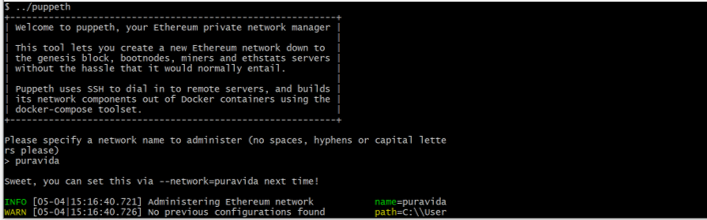
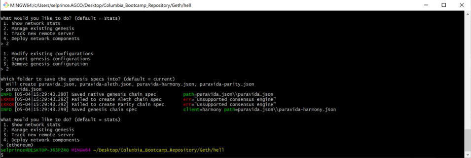
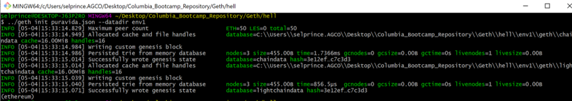
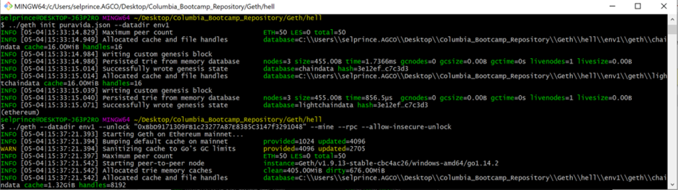
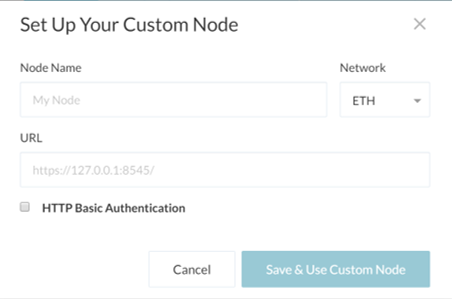
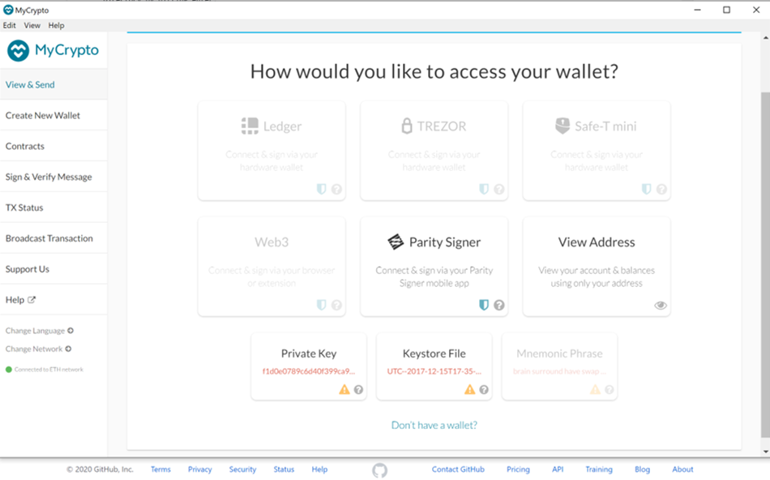
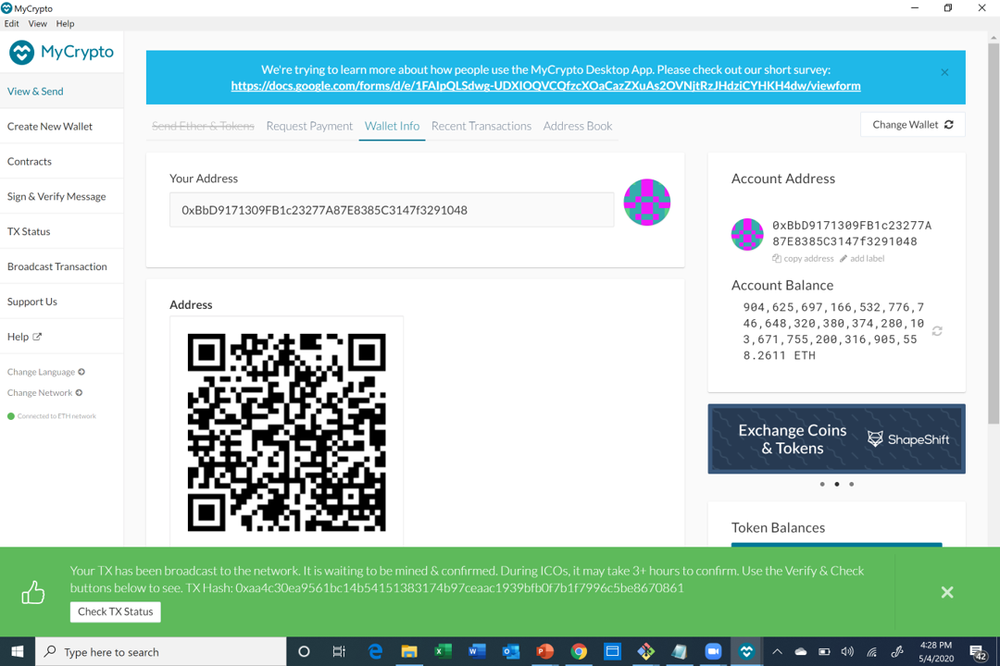
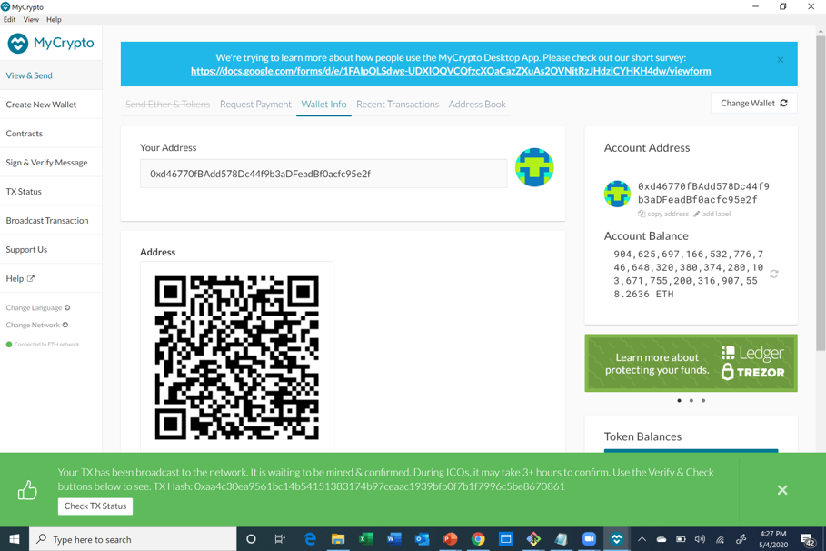

# **Assignment_18:ZBank**

Instruction for launching a new chain using windows.

I hope you all are excited about creating your first new private testnet blockchain! If you follow the below steps carefully you will successfully create a blockchain.

## **Instructions**

Required software:

1. Geth (https://geth.ethereum.org/downloads/)
2. Puppeth 
3. myCrypto (https://download.mycrypto.com/)

## **Creating the nodes:**

To start the process you will need to create at least two nodes to be able to test a transaction. This process will require you to install Geth. Once installed you will navigate to the Geth folder. To create the two nodes you will need to input the following code in the gitbash command line (when you launch gitbash its advisable to run it as administrator):

Create Node 1

'./geth account new node 1'

Creating Node 2

'./geth account new node 2'

[1^]Note: 
[1^]You may call the nodes by any name you choose. For instance I used env1 and env2 as the names for my nodes.

After the creation of the accounts it is important to get take a copy of the public key that is produced for each node. You will need this key later.

## **Creating the Genesis**

After the creation of the nodes you will need to create your genesis block. The genesis block forms the basis of the entire blockchain, it is the first block in the chain. To create your genesis you will need to have puppeth installed. To create a genesis you will need to follow the following steps.

1. Launch puppeth and give your genesis a name with the follwoing command in gitbash:

'./puppeth'

2. After launching puppeth you will be asked to give your genesis a name. Insert a name for your genesis and press enter.

3. After you select the genesis name you will be asked a series of questions, please follow the process outlined below. 

[1^]Note: The above assumes a new folder was created to create the nodes in (if you choose not to create a seperate folder you just need 
[1^]to replace ../ with ./

First in the puppeth prompt, you will be asked "What would you like to do?". Select option 2 to configure your genesis from scratch.

[1^]Note: You may have to type your network name again first if you're launching puppeth fresh.

Second in the puppeth prompt, you will be asked "Which consensus engine to use? (default = clique). Select option 2 proof of authority. 

Thrid in the puppeth prompt, you will be asked "How many seconds should block take? (default=15)". It is recommended to enter the default 15 seconds.

Fourth in the puppeth prompt, you will be asked which accounts are allowed to seal. In this stage you will need to paste the public keys that were acquired for node 1 and node 2. 

[1^]Note: When copying the public key make sure to leave out the first two characters "0x"

Fifth in the puppeth prompt, you will be asked "Which accounts should be pre-funded? (advisable at least one)". Please enter atleast the public key from node1 (you can also add other nodes if you wish to pre-fund them, but one is only necessary)

Sixth in the puppeth prompt, you will be asked "Should the precompile-addresses (0x1 .. 0xff) be pre-funded with 1 wei? (advisable yes)". Enter "no"

Lastly you will be asked "Specify your chain/network ID if you want an explicit one (default = random)". Please enter a number you will recall and make sure to take a note of the number as you will need it later in myCrypto.

## **Managing your genesis**

4. After configuring your genesis you will manage your genesis and export your genesis configuration into a [insert your file name].json (give your genesis file a name or just press enter if you are fine with the default setting) file by typing 2 again to choose the Export genesis configuaration option. Continue with the default (current) directory by hitting enter.

## **Getting Ready to Mine!**

In this phase we will get our nodes ready to mine.

1. Now it is time to initialize your nodes by entering the following code in Git Bash:

2. After initializing your nodes its time to run them and start the mining process. In order to run your nodes you will need to input the following:

When your node starts running you should see a line in the code that represents the enode. You will need to copy the enode as it will form part of the code to launch the second node. To run the second node follow the process below:

## **Linking Your Wallet**

After you start the mining process its time to create your wallet in myCrypto. First you will need to open myCrypto (while the nodes are still mining). 

1. You will get to the welcome screen click on the change network icon on the bottom left hand of your myCrypto app. Click on this to add a custom network (note you will need to have your Chain ID, Node name and network name ready for this phase):

[1^]Note: For the URL please enter 127.0.0.1:8545

2.  This will lead you to a window where you can upload your keystore file for your first node. Navigate to your node 1 folder and you will find a folder called "Keystore" click on the folder to upload it to myCrypto and when it uploads to myCrypto you will also be asked to enter your password (this is the password you created for the first node). 

After this is complete you should be able to see the wallet that you linked to your node with the currency already pre-funded.

## **Send a Test Transaction**

Once your wallet is setup with the crypto currency. It is time to test your network by transferring some coins from your first node to your second node. 

1. Select Send Ether & Tokens to send coins from one account to another. Insert your public key for the second node into the 

2. The final step is to ensure your transaction was successful by pressing the "Check TX Status" button as shown in the picture below:

Congratulations you created a private testnet blockchain!

